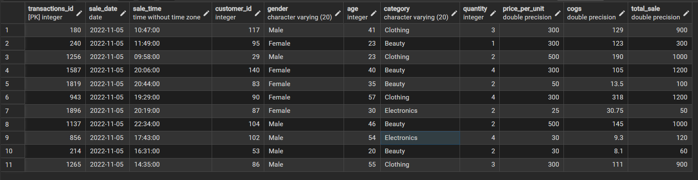
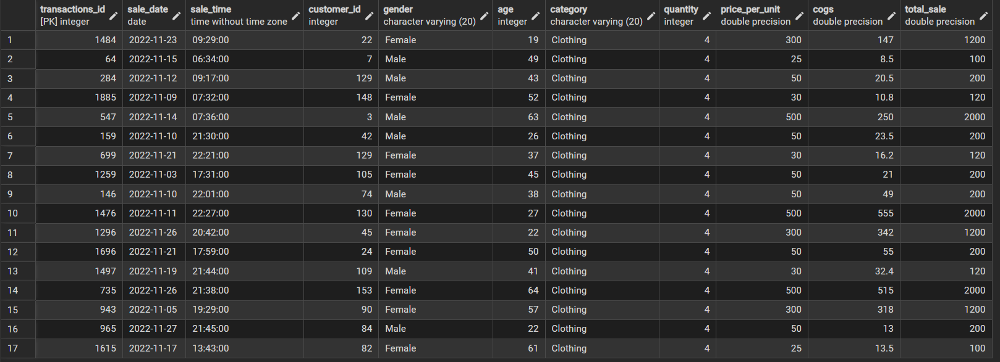
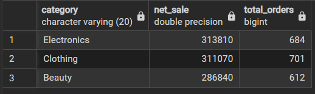
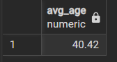
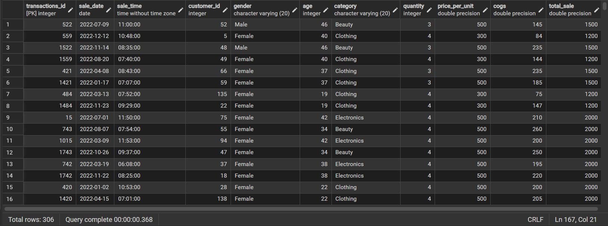
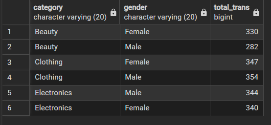
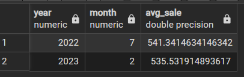
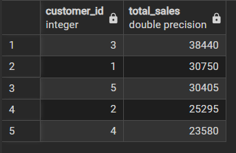
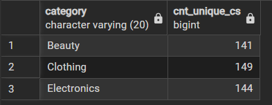
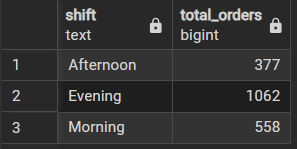

# 🛒 SQL for Data Analysis on Retail Sales  

## 📌 Overview  
This project is part of a **Data Analyst Internship Task (Task 4 – SQL for Data Analysis)**.  
The objective is to use SQL queries to clean, explore, and analyze an **E-commerce retail sales dataset**.  

Repository: [harshharsha17/SQL-for-Data-Analysis](https://github.com/harshharsha17/SQL-for-Data-Analysis)  

---

## 📂 Files in Repository  
- **`Retail_sales_analysis.csv`** → Dataset used for analysis.  
- **`task_4_sql_data_analysis_retail_sales.sql`** → SQL script containing all queries.  
- **`README.md`** → Documentation explaining objectives, steps, and outcomes.  
- **Query screenshots** (`Query1.png` … `Query10.png`) showing output of SQL queries.  

---

## 🛠 Tools Used  
- **Database**: PostgreSQL / MySQL / SQLite  
- **Queries**: SQL (DML + DDL)  

---

## 🔍 Steps Performed  

### 1. Database & Table Creation  
- Created database: `task_4`  
- Created table: `retail_sales` with columns:  
  `transactions_id, sale_date, sale_time, customer_id, gender, age, category, quantity, price_per_unit, cogs, total_sale`.  

---

### 2. Data Cleaning  
- Checked for **NULL values** in critical fields.  
- Deleted rows with missing values to ensure accuracy in analysis.  

---

### 3. Data Exploration  
- Counted **total number of sales**.  
- Found **unique customers**.  
- Extracted **distinct product categories** (Electronics, Clothing, Beauty).  

---

### 4. Data Analysis Queries  

✅ Key SQL Queries answered:  
1. Sales made on a specific date (`2022-11-05`).  
2. Clothing sales with **quantity > 4** in November 2022.  
3. **Total sales & order count** per category.  
4. **Average age** of Beauty product customers.  
5. Transactions with **sales > 1000**.  
6. **Transactions by gender** per category.  
7. **Best selling month** (using `RANK` & window functions).  
8. **Top 5 customers** based on sales.  
9. **Unique customers per category**.  
10. Orders distribution by **shift (Morning, Afternoon, Evening)**.  

---

## 📖 Concepts Covered  
- SQL Basics: `SELECT`, `WHERE`, `ORDER BY`, `GROUP BY`  
- Aggregate Functions: `SUM`, `AVG`, `COUNT`, `ROUND`  
- `DISTINCT` keyword  
- `CASE` statements for time-based analysis  
- Window Functions (`RANK`)  
- Subqueries  
- Query Optimization (using indexes)  
- Views for reusable queries  

---

## 📸 Query Outputs

**Q1: Sales on 2022-11-05**  


**Q2: Clothing category with quantity > 4 in Nov-2022**  


**Q3: Total sales per category**  


**Q4: Average age of Beauty category customers**  


**Q5: Transactions with total_sale > 1000**  


**Q6: Transactions by gender per category**  


**Q7: Best selling month per year**  


**Q8: Top 5 customers based on total sales**  


**Q9: Unique customers per category**  


**Q10: Orders distribution by shift (Morning, Afternoon, Evening)**  


---

## 🎯 Outcome  
✔ Learned to **clean and manipulate SQL datasets**.  
✔ Performed **exploratory and analytical queries**.  
✔ Gained insights into **customer behavior, sales trends, and category performance**.  

---

## 🚀 How to Run  
1. Clone this repository:  
   ```bash
   git clone https://github.com/harshharsha17/SQL-for-Data-Analysis.git
